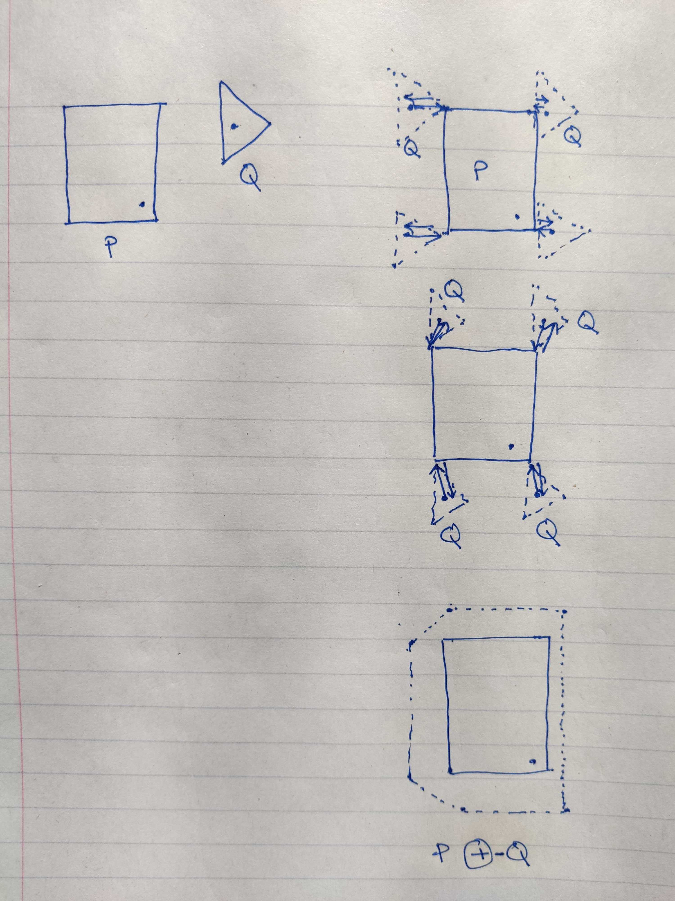

+++
template = "reading.html"
+++

# Interactive examples
These are interactive examples (not mobile friendly yet). They are compiled to wasm format. Each example needs ~20Mb binary download.
- [2 line segement intersection](/wasm?name=xn_2_lnsegs)
- [2 rays intersection](/wasm?name=xn_2_rays)
- [convex hull](/wasm?name=convex_hull)
- [convex spiral](/wasm?name=convex_spiral)

# Questions
Conside a triangle ABC. A point I is inside the triangle. Then C will always be outside circumcirlce made by ABI.


- [x] True.
- [ ] False.


A robot has orientation $\bar{r}$.
We want to align it $\bar{t}$.
How should robot turn to do this the fastest?

- [ ] Always turn left.
- [ ] Always turn right.
- [x] Direction of $\bar{r} \times \bar{t}$.
The direction of cross product gives the fastest alignment direction.
- [ ] Direction of $\bar{t} \times \bar{r}$.


- $L_1 \equiv (1, 2, 3) + t (1, -1, 2)$
- $L_2 \equiv (3, 4, -12) + t (4, 1, 8)$

Select true statements.

- [ ] $L_1$ and $L_2$ are parallel.
- [x] $L_1$ and $L_2$ are not parallel.
- [ ] $L_1$ and $L_2$ are perpendicular.
- [ ] $(-2, 0, 1)$ is the unit normal vector to the plane by $L_1$ and $L_2$.
$(-2/\sqrt{5}, 0, 1/\sqrt{5})$ is the unit normal vector to the plane by $L_1$ and $L_2$.


Two line segments $PQ$ and $RS$ intersect $\leftrightarrow$

- [x] $P, Q$ should be on opposite sides of line $RS$.

- [x] $R, S$ should be on opposite sides of line $PQ$.

line RS divides points P, Q and line PQ divides points R, S $\rightarrow$ segments PR and RS intersect

segments PR and RS intersect $\rightarrow$ line RS divides points P, Q and line PQ divides points R, S



Two rays intersect $\leftrightarrow$

- [x] They should move towards each other cumulatively.
- [x] They should be on the same side of their base.


There are a few points on the plane. Can you draw a triangle with them that contains all points always?

- [ ] Yes.
- [x] No.
Just imagine 4 points making a square. There are $C_3^4 = 4$ triangles possible. None of them contains all points.


<video controls autoplay loop>
  <source src="./convex_hull.mp4" type="video/mp4">
</video>
<video controls autoplay loop>
  <source src="./convex_spiral.mp4" type="video/mp4">
</video>

## Obstacle padding

- minkowski\_sum(P, -Q) can give the minimum distance b/w polygons.
- minkowski\_sum(P, -Q) can say if the polygons intersect.

A quaternion can be described by 3 numbers.
x-coordinate and z-coordinate of axis of rotation and the angle of rotation.
It can be visualized as a cylinder axis aligned with y-axis.
The claim is that a cylinder with radius 1 and height PI placed on x-z plane spans a cone in terms of physical object rotation. Make an interactive program with this cylinder and corresponding rotation visualized. False claim.
