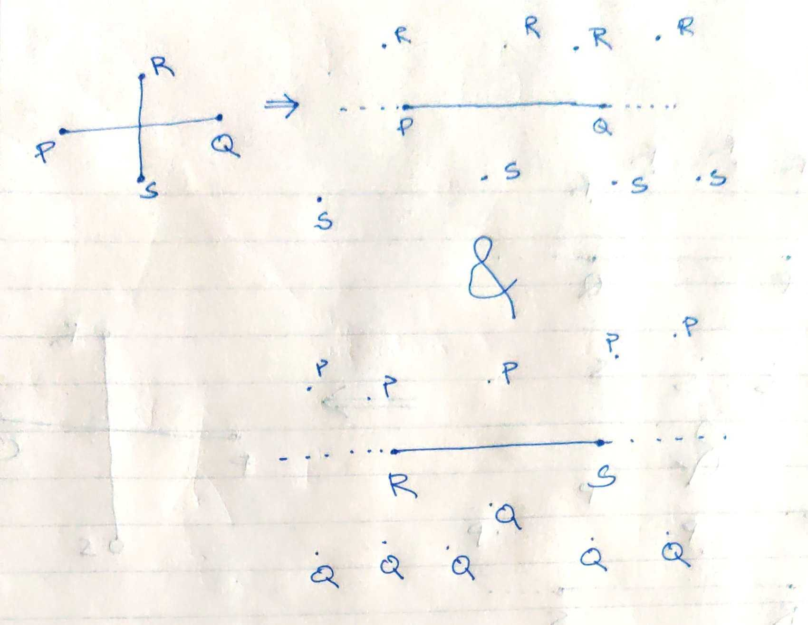

+++
template = "reading.html"
+++
A [diff drive robot](https://en.wikipedia.org/wiki/Differential_wheeled_robot) has a orientation unit vector __c__.
We want to align it with orientation unit vector __t__.
How should robot turn to do this the fastest?

{{ answer(options=[
    [false, "Always turn left"],
    [false, "Always turn righ"],
    [true, "Direction of $+\frac{(c \times t)}{|c| . |t|}"],
    [false, "Direction of $-\frac{(c \times t)}{|c| . |t|}"],
]) }}

A quaternion can be described by 3 numbers.
x-coordinate and z-coordinate of axis of rotation and the angle of rotation.
It can be visualized as a cylinder axis aligned with y-axis.
The claim is that a cylinder with radius 1 and height PI placed on x-z plane spans a cone in terms of physical object rotation. Make an interactive program with this cylinder and corresponding rotation visualized. False claim.

Consider
- $L_1 \equiv (1, 2, 3) + t (1, -1, 2)$
- $L_2 \equiv (3, 4, -12) + t (4, 1, 8)$

Select true statements.

{{ answer(options=[
    [false, "$L_1$ and $L_2$ are parallel"],
    [true, "$L_1$ and $L_2$ are not parallel"],
]) }}

Which of the following is unit normal vector to the plane made by these $L_1$ and $L_2$?

{{ answer(options=[
    [false, "$(1, -1, 2)$."],
    [true, "$(-2/\sqrt{5}, 0, 1/\sqrt{5})$."],
    [false, "$(-10, 0, 5)$."],
    [false, "$(-2, 0, 1)$."],
]) }}

What is the necessary condition for two line segments PQ and RS to intersect?

{{ answer(options=[
    [true, "P, Q should be on opposite sides of line RS"],
    [true, "R, S should be on opposite sides of line PQ"],
]) }}

What is the necessary condition for two rays to intersect?

{{ answer(options=[
    [true, "They should move towards each other cumulatively."],
    [true, "They should be on the same side of their base."],
]) }}

segments PR and RS intersect $\rightarrow$ line RS divides points P, Q and line PQ divides points R, S

<blockquote>

</blockquote>

line RS divides points P, Q and line PQ divides points R, S $\rightarrow$ segments PR and RS intersect

<blockquote>

</blockquote>

[Interactive example](/wasm?name=xn_2_lnsegs)

[Interactive example](/wasm?name=xn_2_rays)

# Convex things

## Hull

[Interactive Demo ~20Mb wasm](/wasm?name=convex_hull)

<video controls autoplay loop>
  <source src="convex_hull.mp4" type="video/mp4">
</video>

## Spiral

[Interactive Demo ~20Mb wasm](/wasm?name=convex_spiral)

<video controls autoplay loop>
  <source src="convex_spiral.mp4" type="video/mp4">
</video>

# Space Sum

## Obstacle padding

- minkowski\_sum(P, -Q) can give the minimum distance b/w polygons.
- minkowski\_sum(P, -Q) can say if the polygons intersect.

