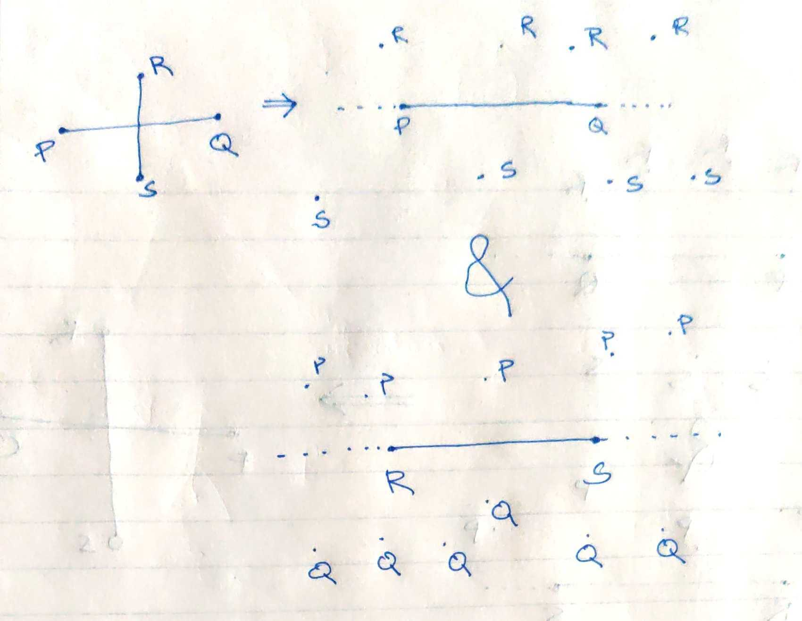
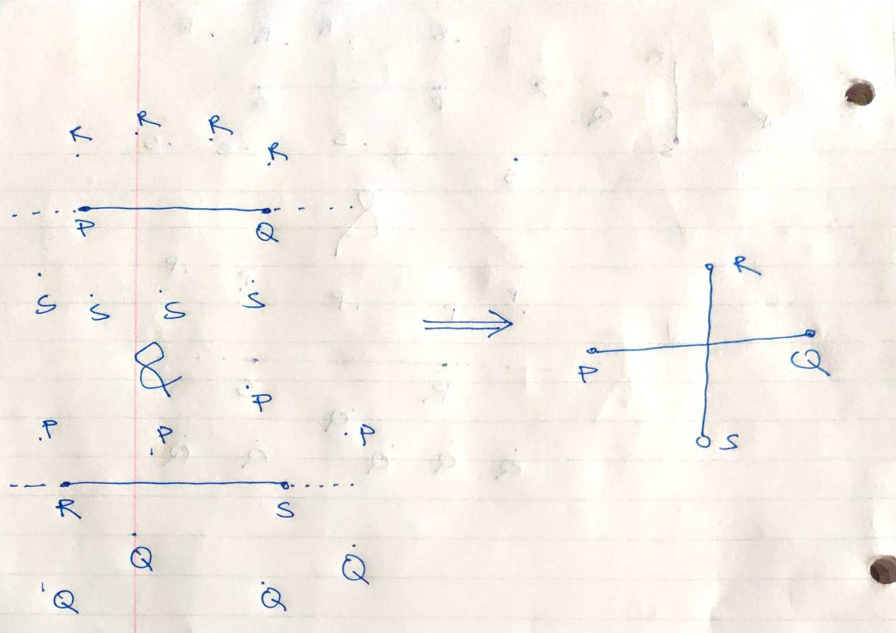

+++
template = "reading.html"
+++

# planar intersections

## linesegment, linesegment

segments PR and RS intersect $\rightarrow$ line RS divides points P, Q and line PQ divides points R, S

<blockquote>

</blockquote>

line RS divides points P, Q and line PQ divides points R, S $\rightarrow$ segments PR and RS intersect

<blockquote>

</blockquote>

What is the necessary condition for two line segments PQ and RS to intersect?
- [ ] P, Q should be on opposite sides of line RS
- [ ] R, S should be on opposite sides of line PQ

Answer

<blockquote>

 - [x] P, Q should be on opposite sides of line RS
 - [x] R, S should be on opposite sides of line PQ

</blockquote>

[Interactive example](/wasm?name=xn_2_lnsegs)

## ray, ray
What is the necessary condition for two rays to intersect?
- [ ] They should move towards each other cumulatively.
- [ ] They should be on the same side of their base.

Answer

<blockquote>

 - [x] They should move towards each other cumulatively.
 - [x] They should be on the same side of their base.
</blockquote>

[Interactive example](/wasm?name=xn_2_rays)

## linesegment, ray
