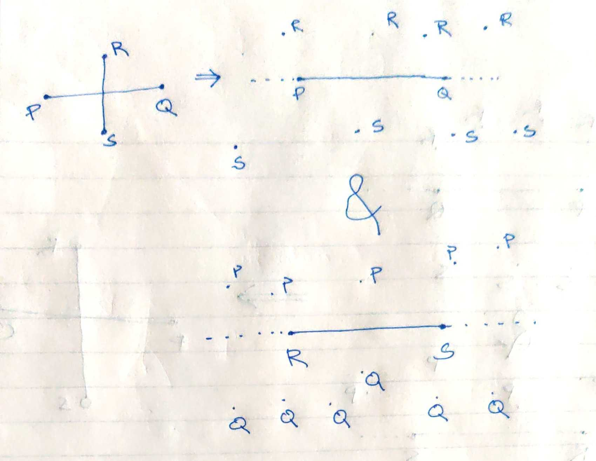
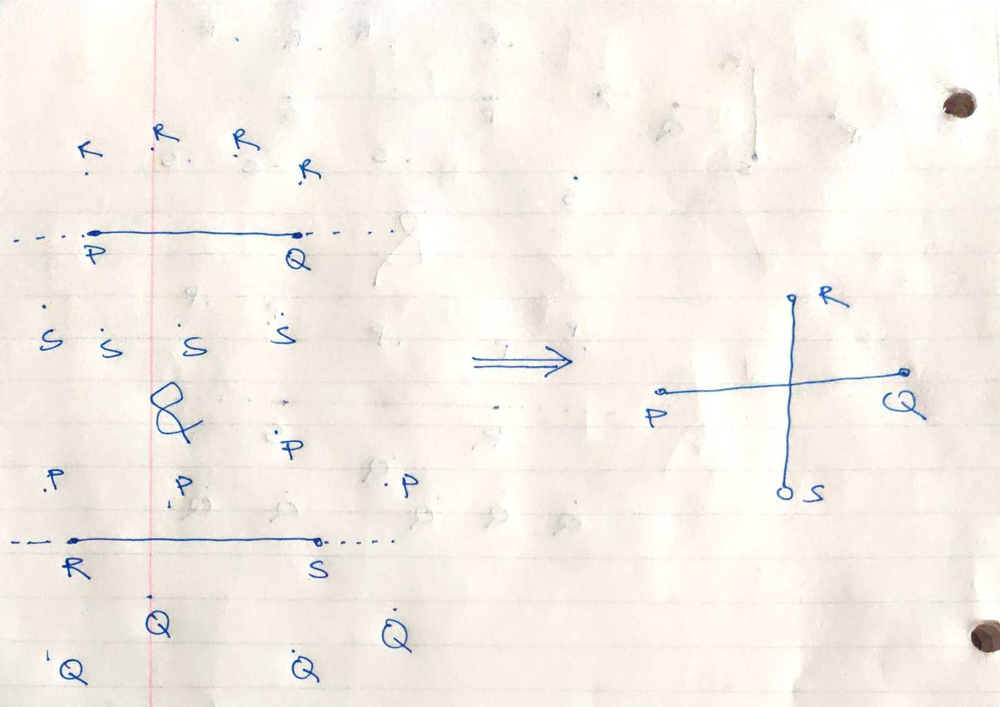
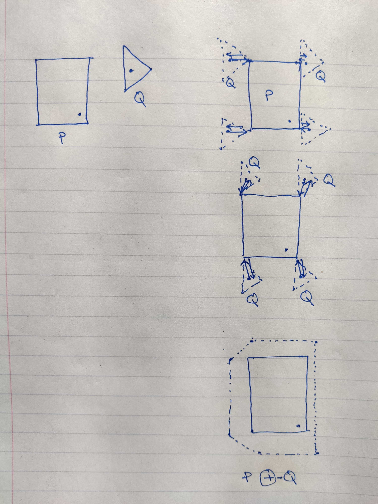

+++
template = "reading.html"
+++

What is the necessary condition for two line segments PQ and RS to intersect?

{{ answer(options=[
    [true, "P, Q should be on opposite sides of line RS"],
    [true, "R, S should be on opposite sides of line PQ"],
]) }}

What is the necessary condition for two rays to intersect?

{{ answer(options=[
    [true, "They should move towards each other cumulatively."],
    [true, "They should be on the same side of their base."],
]) }}

segments PR and RS intersect $\rightarrow$ line RS divides points P, Q and line PQ divides points R, S

<blockquote>

</blockquote>

line RS divides points P, Q and line PQ divides points R, S $\rightarrow$ segments PR and RS intersect

<blockquote>

</blockquote>

[Interactive example](/wasm?name=xn_2_lnsegs)

[Interactive example](/wasm?name=xn_2_rays)

# Convex things

## Hull

[Interactive Demo ~20Mb wasm](/wasm?name=convex_hull)

<video controls autoplay loop>
  <source src="convex_hull.mp4" type="video/mp4">
</video>

## Spiral

[Interactive Demo ~20Mb wasm](/wasm?name=convex_spiral)

<video controls autoplay loop>
  <source src="convex_spiral.mp4" type="video/mp4">
</video>

# Space Sum

## Obstacle padding

- minkowski\_sum(P, -Q) can give the minimum distance b/w polygons.
- minkowski\_sum(P, -Q) can say if the polygons intersect.

